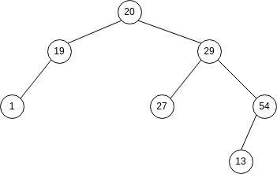
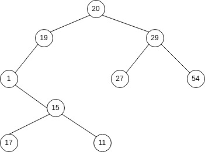

# Guía 12
## Implementación de las diapositivas

En la siguiente carpeta se encuentra la implementación del código suministrado en la clase:

- `/binarytree`, código del binarytree como del binarynode

En la siguiente carpeta se encuentran los test del código suministrado en la clase:

- `/tests`

## Ejercicios

En la carpeta `/ejercicios` encontrarás una implementacion de un binarytree para enteros que deberas usar para resolver los ejercicios

### Ejercicio 1
Escribir un método recursivo que calcule (y devuelva) la suma de todos los nodos en un árbol binario de enteros. El método debe devolver 0 si el árbol está vacío

Por ejemplo: 2 + 7 + 5 + 2 + 6 + 9 + 5 + 11 + 4 =  51

### Ejercicio 2
Escribir un método recursivo que calcule (y devuelva) la suma de los nodos hojas en un árbol binario de enteros. El método debe devolver 0 si el árbol está vacío

Por ejemplo: 2 + 5 + 11 + 4 =  22

### Ejercicio 3
Escribir un método recursivo que calcule (y devuelva) la suma de los nodos internos en un árbol binario de enteros. El método debe devolver 0 si el árbol está vacío o solo tiene raiz o raiz y hojas

Por ejemplo: 7 + 5 + 6 + 9 =  27

### Ejercicio 4
Escribir un método recursivo que calcule (y devuelva) la suma de todos los valores pares de los nodos en un árbol binario de enteros. El método debe devolver 0 si el árbol está vacío

Por ejemplo: 2 + 2 + 6 + 4 =  14

### Ejercicio 5
Escribir un método recursivo que calcule (y devuelva) la cantidad de nodos cuyo valor es mayor o igual que 6 de un árbol binario de enteros. El método debe devolver 0 si el árbol está vacío

Por ejemplo: 7 + 6 + 9 + 11 =  33

### Ejercicio 6
Escribir un método recursivo que calcule (y devuelva) la mayor altura entre el sub-árbol izquierdo y derecho de un árbol binario de enteros. El método debe devolver -1 si el árbol está vacío

Por ejemplo: debe devolver 3

### Ejercicio 7
Escribir un método recursivo que calcule (y devuelva),la suma de todas las hojas de un árbol binario de enteros que son hijas izquierdas de un nodo. El método debe devolver 0 si el árbol está vacío

Por ejemplo: 17 + 27 = 44

### Ejercicio 8

Escribir un método recursivo para un árbol binario de enteros, que calcule (y devuelva) la suma de todos los nodos derechos cuyo valor es impar. El método debe devolver 0 si el árbol está vacío

Por ejemplo: 29 + 15 + 11 = 55
